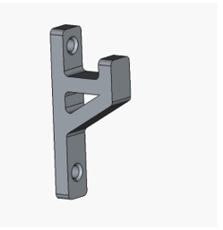
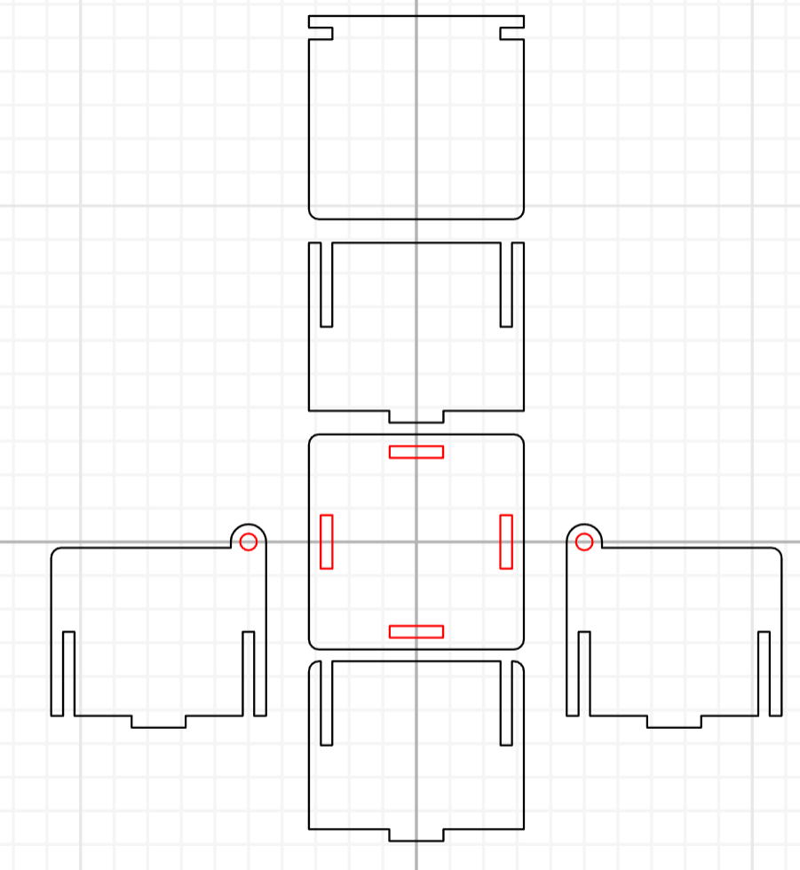

# Day 02 – Digital Modeling for Fabrication

## Overview

Digital Modeling for Fabrication refers to the process of creating accurate digital 2D or 3D models using computer-aided design (CAD) tools, specifically intended for **digital fabrication technologies**.

- The digital model defines the **shape, dimensions, and features** of an object  
- It accounts for **material properties, tolerances, joints, and assembly methods**  
- The model is directly used to generate **machine instructions** for tools such as **laser cutters, CNC routers, and 3D printers**

---

## 1. Printable Product for Experiencing the 3D Machine

### Images

  

### Activity 1 – FreeCAD Model

**Design Characteristics**

- Two flat faces at 90°  
- Two circular holes for screws or bolts  
- Simple geometry with no complex curves  
- One filleted corner for **safety and manufacturability**

### Images
  
  
  
  
  

---

## 2. Activity 2 – Inkscape Model

**Press-Fit Box Panel (2D Vector)**

**Task 1: Design Characteristics**

- A flat rectangular panel  
- Rectangular slots cut into the edges  
- Slots sized to match material thickness  
- Designed to slide and lock with other panels  
- Entirely **2D vector geometry**

### Image

---

## 3. Modeling Approach (Inkscape) of Final Product

Inkscape is an open-source vector graphics design software widely used for **2D digital modeling** in fabrication workflows, especially for **laser cutting, vinyl cutting, and CNC engraving**.

In this modeling approach, designs are created as **vector paths rather than raster images**, ensuring **precise, scalable, and machine-readable geometry**.  
Inkscape allows accurate control of **dimensions, line thickness, colors, and layers**, which are essential for defining **cutting, engraving, and scoring operations**.

### Images

