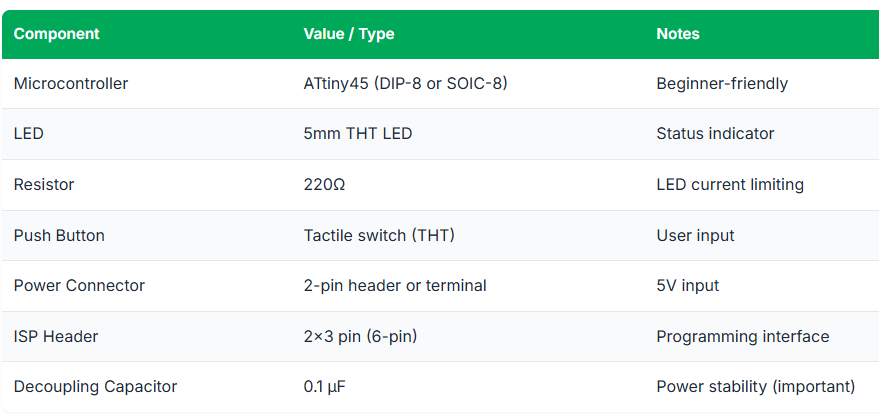
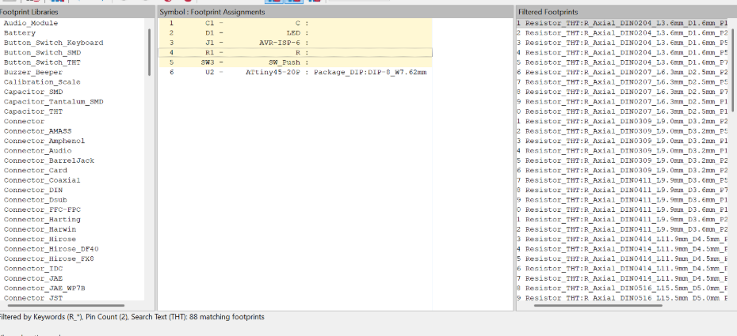
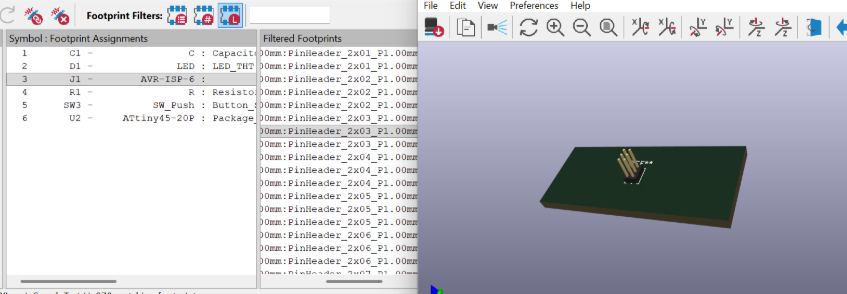

# PCB Milling Techniques & Fabrication Process

## 1. Overview

On Day 3, the focus was on <strong>PCB design for fabrication</strong>, specifically creating a <strong>single-sided microcontroller PCB using KiCad</strong>. The main goal was to understand the complete workflow, from <strong>schematic creation</strong> to <strong>PCB layout</strong>, and finally preparing the design for <strong>milling and soldering</strong>.

KiCad is a <strong>free and open-source PCB design software</strong> that supports the entire PCB development cycle, including schematic capture, layout design, and generating fabrication-ready files. It is widely used for both learning and professional PCB development because it ensures <strong>precise and manufacturable designs</strong>.

---

## 2. KiCad Workflow

The PCB design process in KiCad follows a structured workflow, where each step builds on the previous one to ensure a robust and functional final product:

1. <strong>Schematic Creation</strong> – Define the electrical connections between components using logical symbols  
2. <strong>Footprint Assignment</strong> – Link schematic symbols to physical footprints  
3. <strong>PCB Layout</strong> – Arrange components and route traces  
4. <strong>Design Rule Check (DRC)</strong> – Validate the design against manufacturing constraints  
5. <strong>Fabrication Files Generation</strong> – Export Gerber and drill files  

---

## 3. Single-Sided Microcontroller PCB Design

### Objective

Design a <strong>single-sided PCB</strong> in KiCad with the following specifications:

- <strong>Microcontroller:</strong> ATtiny45  
- <strong>Functionality:</strong> Control an LED using a push button  
- <strong>Programming Interface:</strong> 6-pin ISP header  
- <strong>Fabrication Suitability:</strong> Optimized for PCB milling and hand soldering  

### Expected Activity Outcomes

- Translate a schematic into a <strong>manufacturable PCB layout</strong>  
- Apply <strong>design rules</strong> to ensure reliability  
- Generate <strong>fabrication files</strong> ready for milling and assembly  

---

## 4. Conceptual Block Diagram

*Figure 1: Conceptual block diagram of the PCB system.*

---

## 5. List of Components

*Figure 2: List of electronic components used in the PCB design.*

---

## 6. Schematic Capture

The schematic was created in KiCad by placing all components and connecting them correctly according to the circuit design.

*Figure 3: Schematic capture created in KiCad.*

---

## 7. Assigning Footprints

*Figure 4: Assigned footprints for schematic components.*

*Figure 5: Footprint selection and 3D visualization.*

---

## 8. Traces Arrangement on PCB Layout

*Figure 6: Traces arrangement on the PCB layout.*

---

## 9. 3D Viewer

*Figure 7: 3D view of the PCB design.*

---

## 10. Routed PCB

*Figure 8: Final routed PCB ready for fabrication.*

---

## 11. Challenges and Lessons Learned

### Challenges

Routing the PCB presented significant challenges, particularly because in <strong>single-sided PCB designs</strong>, traces cannot cross each other. This limitation required careful planning of <strong>component placement</strong> and <strong>trace routing</strong> to avoid congestion.

### Key Learnings

- <strong>Component placement</strong> is critical for successful single-sided PCB routing  
- <strong>Early planning</strong> reduces routing complexity  
- <strong>Designing for fabrication</strong> requires thinking beyond electrical connections  
