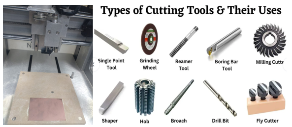

# Day 4: Understanding Materials Through Making

## Overview

Materials are not just components; they are the <strong>foundation of what we create</strong>. They determine <strong>durability</strong>, <strong>functionality</strong>, and <strong>sustainability</strong>. Every material choice influences the entire <strong>product lifecycle</strong>, from fabrication to long-term use.

Key principles explored during this day include:

- <strong>Materials define what is possible, durable, and sustainable</strong>  
- <strong>Fabrication methods influence form, accuracy, and cost</strong>  
- <strong>Design decisions must align material and process for optimal results</strong>  

---

## 1. Wood

Wood is a widely used material in fabrication due to its <strong>availability</strong>, <strong>workability</strong>, and <strong>natural aesthetics</strong>. It is commonly used in furniture, enclosures, and structural prototypes.

### Common Processes

- <strong>CNC Routing</strong> for intricate and repeatable shapes  
- <strong>Laser Cutting</strong> for precise detailing and fast prototyping  

*Figure 1: Wood material used in fabrication processes.*

---

## 2. Plastics

Plastics offer a balance between <strong>flexibility</strong>, <strong>strength</strong>, and <strong>lightweight properties</strong>. One example explored is <strong>carbon fiber filament</strong>, a functional filament created by mixing carbon fiber powder with PETG.

Carbon fiber is an <strong>extremely strong and lightweight fiber-reinforced plastic</strong>. It is commonly used in applications that require <strong>high strength-to-weight ratio</strong>, such as mechanical parts and structural components.

*Figure 2: Plastic material example used in fabrication.*

---

## 3. Metals

Metals are indispensable for applications that demand <strong>exceptional strength and durability</strong>. They are widely used across industries such as aerospace, construction, electronics, and consumer goods.

### Common Metals

- <strong>Copper</strong>  
- <strong>Aluminum</strong>  
- <strong>Steel</strong>  
- <strong>Brass</strong>  

*Figure 3: Copper board and metal cutting tools.*

---

## 4. Shurtape Brand Tape

Shurtape is a well-known manufacturer of <strong>industrial and professional-grade tapes</strong>. The name <strong>“Shurtape”</strong> is visible on the inside core of the tape roll.

Shurtape produces a wide range of tapes, including:

- <strong>Double-sided cloth tapes</strong>  
- <strong>Paper tapes</strong>  

These tapes are commonly used for <strong>mounting</strong>, <strong>holding</strong>, <strong>splicing</strong>, and <strong>securing materials</strong> such as carpet and fabrication components.

*Figure 4: Shurtape brand industrial tape.*

---

## 5. Black Spanner Wrench

Spanner wrenches are specialized tools used to <strong>tighten</strong>, <strong>loosen</strong>, or <strong>adjust</strong> round nuts and retaining rings that do not have traditional hexagonal or square edges.

They are commonly used in <strong>mechanical assembly</strong>, <strong>machine maintenance</strong>, and <strong>precision adjustments</strong>.

*Figure 5: Black spanner wrench used for mechanical adjustments.*

---

## Reflection

Understanding materials through hands-on making reinforces the idea that <strong>design is inseparable from material choice</strong>. Selecting the right material and fabrication process leads to <strong>better performance</strong>, <strong>lower cost</strong>, and <strong>more sustainable outcomes</strong>.
