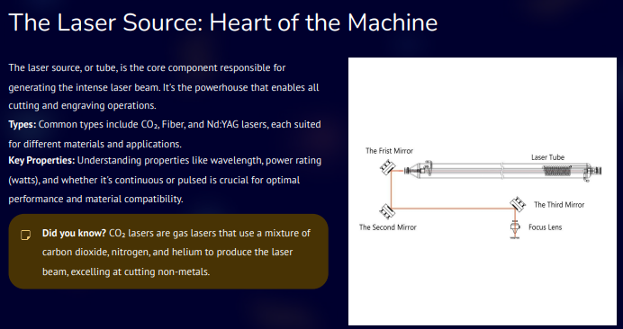

## Introduction to Laser Cutting

Laser cutting is a <strong>digital fabrication process</strong> that uses a highly focused laser beam to <strong>cut</strong>, <strong>engrave</strong>, or <strong>etch</strong> materials with very high precision.  
The laser melts, burns, or vaporizes material along a <strong>programmed path</strong> derived from a digital design file.

Laser cutting is widely used because it offers:

- <strong>High precision and repeatability</strong>  
- <strong>Clean edges with minimal post-processing</strong>  
- <strong>Compatibility with many materials</strong> such as wood, plastics, and thin metals  

---

## 1. Hardware Components

The laser cutting machine consists of several critical hardware and interface elements that ensure <strong>safe</strong> and <strong>accurate</strong> operation.

### Safety and Control Components

- <strong>Red Mushroom-Head Button (Top Left)</strong>  
  This is the Emergency Stop (E-STOP) button. When pressed, it immediately cuts power to hazardous machine elements to prevent injury.  
  It is a <strong>latching type</strong> and must be manually reset by twisting or pulling after the emergency is resolved.

- <strong>Safety Interlock and Key Switch</strong>  
  The key switch is part of the safety interlock system.  
  It ensures the machine cannot operate unless required safety conditions are met, such as a protective door being closed.  
  The key also prevents unauthorized operation.

- <strong>Black Knobs or Buttons (Center Top)</strong>  
  These are used for specific machine operations, such as:
  - Motor speed control  
  - Feed rate adjustment  
  - Switching between manual and automatic modes  

- <strong>Touch Screen Interface</strong>  
  This is the primary human-machine interface used to:
  - Load programs  
  - Monitor machine status  
  - Control laser operations  

---

## Screen Interface Elements

The screen interface provides real-time operational control and feedback.

- <strong>Pause and Stop Buttons (On Screen)</strong>  
  These buttons allow controlled stopping of the machine during normal operation.  
  Unlike the physical E-STOP, they stop the process gracefully.

- <strong>Time and Parameter Display</strong>  
  Indicators such as <strong>00:00:48</strong> and <strong>2.6</strong> typically show:
  - Elapsed job time  
  - Software version or machine parameter values  

- <strong>Central Graphic and New Project Option</strong>  
  The graphic represents the machine’s operational state or laser path visualization.  
  The New Project option allows starting or loading a new job.

- <strong>On-Screen E-STOP</strong>  
  A software-based emergency stop that mirrors the function of the physical E-STOP through control logic.

- <strong>Status Indicators</strong>  
  Icons and text such as <strong>WB 172.17.26.21</strong> and <strong>WiFi Connected</strong> indicate:
  - Network connectivity  
  - Machine IP address on the local network  

---

## 2. Heart of the Machine

The most critical component of a laser cutter is the <strong>laser source</strong>, which generates the high-energy beam required for cutting and engraving.

*Figure 1: Laser source, the heart of the laser cutting machine.*

---

## 3. Laser Cutting System

A laser cutting system works by focusing a high-energy laser beam onto the surface of a material to cut, engrave, or mark it.

The general working principle includes:

- The <strong>laser source</strong> generates a coherent and intense beam of light  
- The beam is guided using <strong>mirrors</strong> and focused through a <strong>lens</strong>  
- When the focused beam hits the material, it <strong>melts, burns, or vaporizes</strong> it  
- An <strong>assist gas</strong> such as air, oxygen, or nitrogen removes molten material  
- The <strong>motion system</strong> moves the laser head or workpiece along the programmed path  

---

## Main Parts of a Laser Cutter

### a) Laser Source
- Generates the laser beam  
- Common types include:
  - CO₂ laser  
  - Fiber laser  
  - Diode laser  
- Determines cutting power and material compatibility  

### b) Power Supply
- Provides electrical energy to excite the laser medium  

### c) Mirrors
- Direct the laser beam from the source to the cutting head  
- Ensure accurate beam alignment  

### d) Focusing Lens
- Concentrates the laser beam into a very small spot  
- Higher focus results in higher energy density and precise cutting  

### e) Cutting Head or Nozzle
- Houses the focusing lens  
- Directs assist gas onto the cutting area  

### f) Assist Gas System
- Uses air, oxygen, or nitrogen  
- Removes molten material and improves cut quality  

### g) Motion Control System
- Includes motors, rails, belts, or lead screws  
- Moves the laser head or work bed in X–Y and sometimes Z directions  

### h) Work Bed
- Supports the material being cut  
- Often honeycomb or slatted to reduce reflections  

### i) Control System
- Includes controller and software  
- Converts CAD designs into machine instructions  
- Controls speed, laser power, and cutting paths  

---

## Laser Cutting Operations

Laser cutters can perform multiple operations depending on power and settings.

### Cutting
- Laser completely penetrates the material  
- Used for parts, shapes, and profiles  

### Engraving
- Laser removes only the surface layer  
- Used for text, logos, and decorative patterns  

### Marking
- Laser changes surface color without removing material  
- Used for labeling and identification  

*Figure 2: Complete laser cutting system and working principle.*
